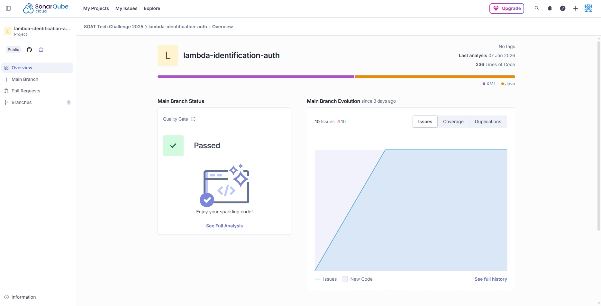

# Lambda de Autenticação (JWT)

## Visão Geral

Esta AWS Lambda implementa um **endpoint simples de autenticação baseada em JWT**, exposta via **API Gateway HTTP API (v2)**. Ela permite:

* **Login** (`/login`) para geração de token JWT
* **Consulta do usuário autenticado** (`/me`) a partir de um token válido

A função foi desenvolvida em **Java**, utilizando a biblioteca **jjwt** para criação e validação de tokens.

---

## Tecnologias Utilizadas

* Java
* AWS Lambda
* API Gateway HTTP API (v2)
* JWT (JSON Web Token)
* Biblioteca `io.jsonwebtoken (jjwt)`
* Jackson (JSON)

---

## Variáveis de Ambiente

| Variável     | Obrigatória | Descrição                                                                               |
| ------------ | ----------- | --------------------------------------------------------------------------------------- |
| `JWT_SECRET` | Sim         | Chave secreta usada para assinar os tokens JWT. Deve conter **mínimo de 32 caracteres** |

> ⚠️ Caso a variável não exista ou seja menor que 32 caracteres, a Lambda lançará erro em tempo de execução.

---

## Fluxo Geral

1. Cliente envia requisição para `/login`
2. Lambda gera um JWT com:

    * `subject` = username
    * `role` = `USER`
    * Expiração de **1 hora**
3. Cliente usa o token no header `Authorization`
4. Endpoint `/me` valida o token e retorna os dados do usuário

---

## Endpoints

### POST `/login`

Gera um token JWT para o usuário informado.

#### Request

**Headers**

```
Content-Type: application/json
```

**Body**

```json
{
  "user": "11122233399"
}
```

#### Regras

* O campo `user` é obrigatório
* Não há validação de senha (modelo simplificado)

#### Response 200

```json
{
  "token": "eyJhbGciOiJIUzI1NiJ9..."
}
```

#### Response 400

```json
{
  "message": "user é obrigatório"
}
```

---

### GET `/me`

Retorna os dados do usuário autenticado a partir do JWT.

#### Request

**Headers**

```
Authorization: Bearer <TOKEN_JWT>
```

#### Response 200

```json
{
  "user": "11122233399",
  "role": "USER"
}
```

#### Response 401

```json
{
  "message": "Token não informado"
}
```

---

## Estrutura do Token JWT

O token gerado contém:

| Claim  | Valor                       |
| ------ | --------------------------- |
| `sub`  | Username informado no login |
| `role` | `USER`                      |
| `iat`  | Data de emissão             |
| `exp`  | Data de expiração (1 hora)  |

Assinatura:

* Algoritmo: **HS256**
* Chave: `JWT_SECRET`

---

## Códigos de Status HTTP

| Código | Descrição           |
| ------ | ------------------- |
| 200    | Sucesso             |
| 400    | Requisição inválida |
| 401    | Não autorizado      |
| 404    | Rota não encontrada |
| 500    | Erro interno        |

---

## Logs

A Lambda registra nos logs:

* Path da requisição
* Método HTTP
* Mensagens de erro (em caso de exceção)

Exemplo:

```
PATH=/login
METHOD=POST
```

## Sonar



---
